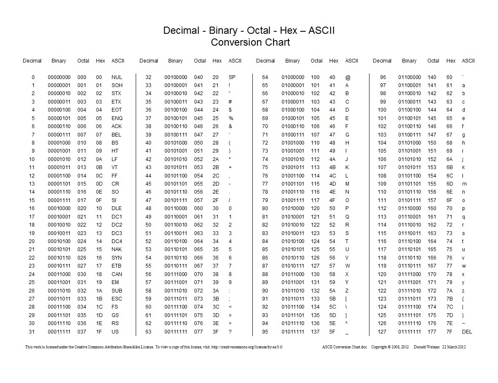
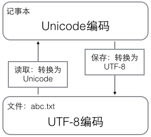

# 编码问题

（以下内容为学习文末参考资料后的总结，纯为个人的学习记录）

### 计算机中的编码

数据都是以0、1二进制形式存储的。

#### ASCII

可是，0、1什么的人哪里看得懂，为了表示成人能看得懂的语言，美国佬发明了`ASCII`码。因为当时只考虑了英语这门语言，而英语无非就26个字母，再加上数字、标点符号及控制，也就127个字符编码，所以用一字节（8比特，2^8 = 256）来表示绰绰有余。

编码就是字符对应的二进制的关系，如ASCII码'A'对应的二进制为01000001。

​							<!--more-->



#### GBK

后来，计算机传入了中国。那中文没办法用ASCII码表示啊？`GBK`嘛，就是中国人发明来表示汉字的，其前身为`GB0`，兼容ASCII，但是由于GB0只收录了6000多个汉字，缺少生僻字和繁体字，后面就诞生出了GBK，其还包含了少数民族文字。

这套标准至今仍有更新，在如今的win10简体中文版中，记事本保存的默认编码`ANSI`，实际上对应的就是这套标准。

#### ANSI

`ANSI`是什么？

> ANSI指的是对应当前系统 locale 的遗留（legacy）编码。

比如大陆这块对应的就是GBK，是为了提防出现几十年前的老文档的情况才用的这种编码，否则都用Unicode去了。

#### Unicode

上面说的ASICII和GBK等编码都只考虑了本土行情。。。全世界有那么多国家和语言，上面两种规范根本没法表示它们，比如日本用XXX，韩国用XXX，乱套了。

因此，统一联盟国际组织提出了`Unicode`，它是一种字符集。

它有UCS-2和UCS-4两种格式，前者为16位，可以表示65536个字符，但还是没法囊括那么多语言啊，汉字的数量就已经超过它的范围了。

于是，UCS-4出现了，用32个位去表示一个字符，32位的UCS-4理论上可以表示已有的字符（实际上只用了31位，最高位必须为0）。

> 常用的英文字母被编码成1个字节，汉字通常是3个字节，只有很生僻的字符才会被编码成4-6个字节。

#### 问题

好了，搞这么久大家终于统一了，这样就不会乱码了。。。

但这**只是规定了某一个字符对应的二进制**！和ASCII码时代不同了。

为什么这么说？

在ASCII码时代，一个'a'可以用8位表示，存储和传输都是8位，多方便啊，表示、传输、存储都是统一的8位，没任何毛病！此时可以看作字符代码和字符编码是一样的。

而对于Unicode，如果一个Asicii字符'a'我也用32位去存储、传输，那一篇满是英文和符号字符的文章传输起来得多浪费时间空间？中文也是，明明2或3个字节表示的，结果却要按4个字节来传输，不行！

所以，**"怎么存储"**和**"怎么传输"**就成了新的问题。

#### UTF（Unicode Transformation Format）

新问题伴随新的解决办法，`UTF`出现了。它是Unicode的**一种实现方式**，相当于**在Unicode的基础上再定义了一套编码方式**，其任务就是**在保持Unicode这种通用性的同时解决其空间占用问题**。

UTF-8、UTF-16就是用n个8位、16位去表示一个Unicode码。

在传输时，就可以把Unicode映射成UTF-8编码，遇到不同的情况就把Unicode转换成不同长度的UTF-8编码，因此UTF-8也称作变长码，UTF-16也是。比如遇到ASCII码就可以转换为长度为1字节的UTF-8，汉字就转换为3字节的。

> 2016年互联网87%的网页是用UTF-8编码的。

如下图：

> | 字符 | ASCII    | Unicode           | UTF-8                      |
> | ---- | -------- | ----------------- | -------------------------- |
> | A    | 01000001 | 00000000 01000001 | 01000001                   |
> | 中   | x        | 01001110 00101101 | 11100100 10111000 10101101 |

如果传输的数据里比较多的字符是ASCII字符，对应的UTF-8占8位，Unicode占16位，传输效率就会提升。

若为中文，则UTF-16相对UTF-8效率会高一些，因为UTF-16可以直接表示比较常用的2字符中文字符，即UTF-16可以用2字节表示常用中文字符，而UTF-8却要用3字节。

#### 一些坑及疑惑

由于UTF的可变长性，传输、存储在硬盘的时候就使用UTF-8编码（节省空间）。

而在计算机内存中，就使用Unicode。

**第一个疑惑：**上部分的中文字，明明Unicode是16位，为啥转为UTF-8就要24位了？

```
答：跟UTF-8的实现有关。

UTF-8规定，若1字符=3字节，高位字节前3位为‘1110’，后面低位前2位一律为‘10’，
若1字符=1字节，首位须为‘0’。

如上面的'中',UTF-8编码为**1110**0100 **10**111000 **10**101101，加粗部分是UTF-8规定的占用位，用来标识这是几个字节的字符，所以除去这些占用位，2个字节的UTF-8是没法去表示2个字节的Unicode的。
```

> 

我在廖雪峰的网站上看见如上图，记事本打开文件中，存储在磁盘上的abc.txt数据被读入到内存中，就会转换为Unicode编码。

**这里的坑是**：实际上，在 Windows环境中，记事本的Unicode指的是`UTF-16`。下文再提windows下的编码问题。。。

那我又疑惑了。。。为啥要转换来转换去，不直接用UTF-8编码呢？反正它既可以解决乱码问题，又可以解决变长问题。

> 答：
>
> - 也是跟UTF-8的实现机制有关，正因为它是可变长的，所以UTF-8编码的字符串长度和字符个数没有固定换算关系，导致排版，排序之类的复杂度上升。
>
> - 举个例子：
>   “ZH药丸” 是一个四个**字符**的字符串
>
>   ```
>   UTF-8 编码是 "5A 48 e88daf e4b8b8"
>   UTF-16 编码是 "005a 0048 836f 4e38"
>   ```
>
>   如果我想让你找到第四个字符是啥，UTF-8 必须扫过整个 字节流，而使用 UTF-16 的话，直接取出第四个16位整形（4e38）就好了。
>
>   但是我们存储在硬盘上的字符串是不需要**处理**的，这时候通常情况下比较节约存储空间的UTF-8 就成为了首选。

意思就是：UTF-8是变长码，所以在内存里不好识别咯。而定长的Unicode就可以提高数据在内存中的运算效率。

总结：UTF-8的可变长有其优势也有其劣势！

#### Windows记事本下的编码

> - 所谓的「ANSI」指的是对应当前系统 locale 的遗留（legacy）编码。[1]

因为ANSI是windows早期使用的，而后才支持的Unicode。所以就要考虑兼容问题了，怎么办？微软的办法就是当字符无法用unicode时，就使用默认语言（电脑里的区域和语言选项）编码解释，比如大陆就是GBK，实际上这种编码就是ANSI。

那么记事本怎么知道一段编码是哪种规范的呢？那就是靠BOM了，打开txt时，最前面有一个标签就是BOM。

> 标签叫BOM，如果是0xFF 0xFE，是UTF16LE，如果是0xFE 0xFF则UTF16BE，如果是0xEF 0xBB 0xBF，则是UTF-8。如果没有这三个东西，那么就是ANSI，使用操作系统的默认语言编码来解释。

BOM是为了兼容和跨平台设计的，但加了BOM很多程序仍没法处理，反而导致出现问题。所以，最好别用windows记事本。。。

那么，微软为啥要用UTF-16？

```
答：
这是微软当年的一个坑，早期用ANSI。后来Unicode出现了，当时Unicode为UCS-2格式时，字符用16位表示，当时的UTF-16本质上就是16位的定长码。(包括英文字符啥的都得用16位存储和传输，还是浪费空间的，但胜在能涵盖“当时的所有字符”)

后面由于Unicode发展为UCS-4格式，使得UTF-16没法包含原来的所有字符了，需要加入机制来表示新的标准字符，从而UTF-16变成了变长码。。。
```

现在的UTF-32就是定长码，其位数和字符集（UCS-4）大小一致，能一次解析出字符，但是正如上面所说的浪费问题，基本不会采用。

------


参考资料：

> [Python 编码为什么那么蛋疼？ - 刘志军的回答 - 知乎](https://www.zhihu.com/question/31833164/answer/114694586)
>
> [字符串和编码 - 廖雪峰的官方网站](https://www.liaoxuefeng.com/wiki/0014316089557264a6b348958f449949df42a6d3a2e542c000/001431664106267f12e9bef7ee14cf6a8776a479bdec9b9000)
>
> [在计算机中为何不直接使用UTF8编码进行存储，而要使用Unicode再转换成UTF8？](https://www.zhihu.com/question/52346583)
>
> [为什么那么多网站钟情 UTF-8？](https://www.zhihu.com/question/19817672)
>
> [Windows 记事本的 ANSI、Unicode、UTF-8 这三种编码模式有什么区别？](https://www.zhihu.com/question/20650946)
>
> 

下面的参考还讲到了从UCS-2发展成UCS-4的过程中一些有意思的历史，推荐一看。

> 在计算机中为何不直接使用UTF8编码进行存储，而要使用Unicode再转换成UTF8？ - 云采月的回答 - 知乎
> https://www.zhihu.com/question/52346583/answer/130187864